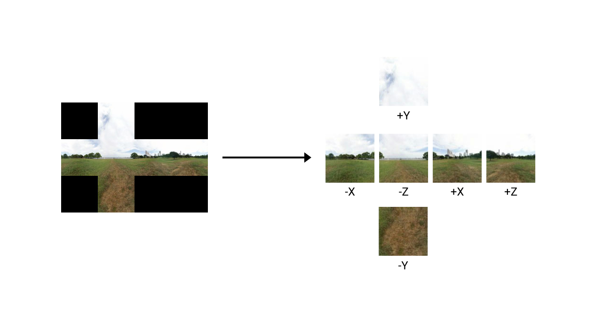

# Rust Cube Map Slicer

## Overview

Rust CubeMap Slice is the openGL base application with Rust.

it cut an cubemap image into six images(pos/neg x, y, z) for WebGL

## Usage

#### put cubemap iamge(only jpeg, sorry, png and gif are not supported)

#### run the app with the indiviaul cubemap like: `cargo run cube` 
* You need put cube.jpg in resouces/textures folder.

#### press "S" to save 6 images(pos/neg x, y, z) in resouces/texture folder.

#### press "esc" to close the app

